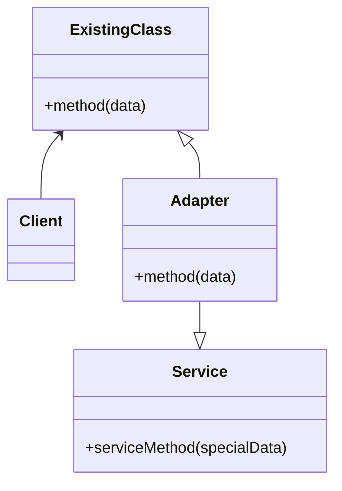
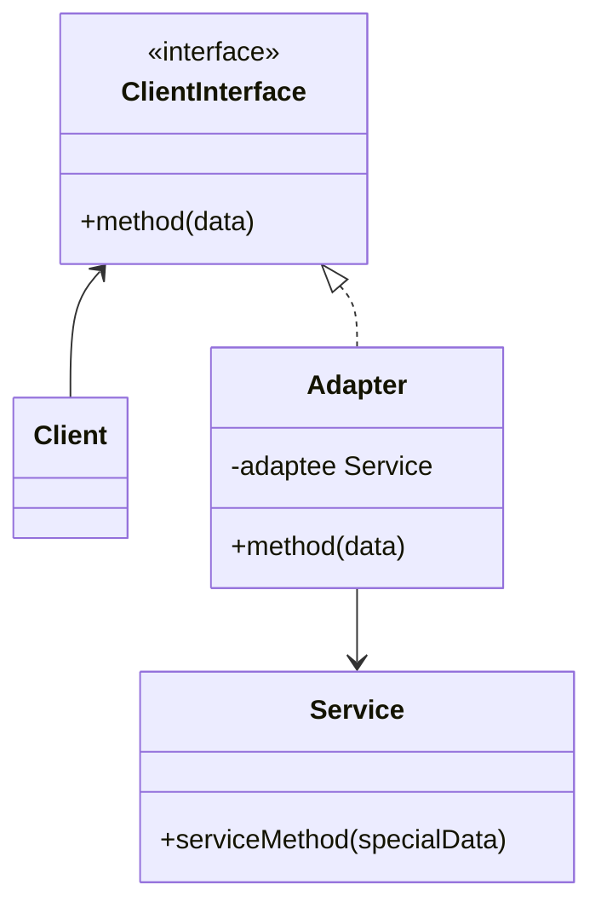

Type: **Structural Pattern**

Adapter is a structural design pattern that allows objects with incompatible interfaces to collaborate.
Use Cases:
- To implement library/package used in app that can change overtime.
- When you want to make a pluggable kit.

Two ways to implements:
- A class adapter: uses multiple inheritance (by extending one class and/or implementing one or
more classes) to adapt one interface to another.

- An object adapter relies on object aggregation.

## Code example:
- Class Adapter

        // Say you have two classes with compatible interfaces:
        // RoundHole and RoundPeg.
        class RoundHole {
            private radius;
            constructor(_radius) {
                this.radius = _radius;
            };
            getRadius() {
                return this.radius;
            };
            isFit(peg) {
                return this.getRadius() >= peg.getRadius();
            };
        };

        class RoundPeg {
            private radius;
            constructor(_radius) {
                this.radius = _radius;
            };
            getRadius() {
                return this.radius;
            };
        };

        class SquarePeg {
            private width;
            constructor(_width) {
                this.radius = _width;
            };
            getWidth() {
                return this.width;
            };
        };
        
        // An adapter class lets you fit square pegs into round holes.
        // It extends the RoundPeg class to let the adapter objects act
        // as round pegs.
        class SquarePegAdapter extends RoundPeg {
            private peg;
            constructor(_peg) {
                this.peg = _peg;
            };
            getRadius() {
                return peg.getWidth() * Math.sqrt(2) / 2;
            };
        }

        // Somewhere in client code.
        hole = new RoundHole(5);
        rpeg = new RoundPeg(5);
        hole.fits(rpeg); // true
        
        small_sqpeg = new SquarePeg(5);
        large_sqpeg = new SquarePeg(10);
        hole.fits(small_sqpeg); // this won't compile (incompatible types)
        
        small_sqpeg_adapter = new SquarePegAdapter(small_sqpeg);
        large_sqpeg_adapter = new SquarePegAdapter(large_sqpeg);
        hole.fits(small_sqpeg_adapter); // true
        hole.fits(large_sqpeg_adapter); // false

- Object Adapter

        class GoogleAuthenticationAdaptee {
            constructor() {};
            public signIn() {};
        };

        class AuthenticationAdapter {
            private adaptee;
            constructor() {
                // Only for example: can easily change to DropboxAuthenticationAdapter
                adaptee = new GoogleAuthenticationAdaptee();
            }
            public signIn() {
                return this.adaptee.signIn();
            }
        };

        // Usage
        const authenticationAdapter = new AuthenticationAdapter();
        const credentials = authenticationAdapter.signIn();

Source: https://refactoring.guru/design-patterns/adapter
