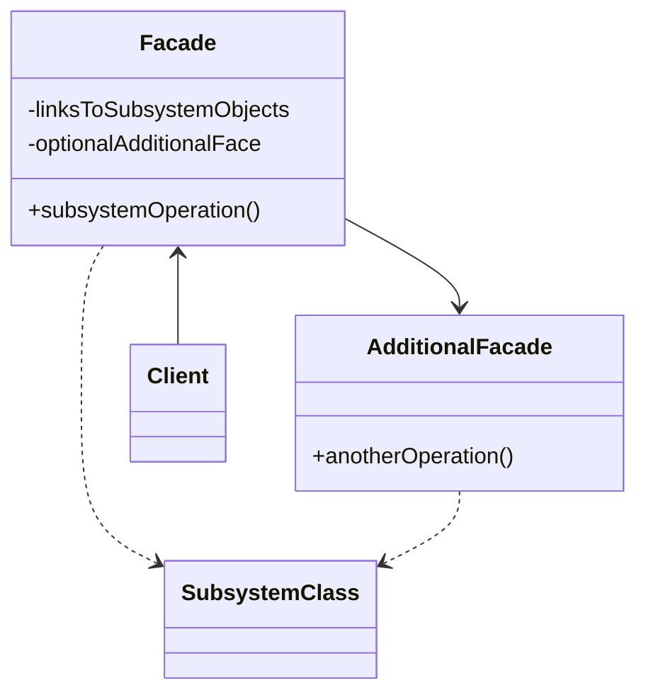

Type: **Structural Pattern**

- Facade is a structural design pattern that provides a simplified interface to a library, a framework, or any other complex set of classes.
- A facade might provide limited functionality in comparison to working with the subsystem directly. However, it includes only those features that clients really care about.

### Real-World Analogy
- We can call the system operator to contact the desired services.

Class Diagram Example:

## Code Example:
        class ShippingClass {
            public fee() {
                return 1;
            };
        };

        class TransportClass {
            public fee() {
                return 1;
            };
        };

        class WarehouseClass {
            public fee() {
                return 1;
            };
        };

        class PaymentFacade {
            private shippingClass: ShippingClass;
            private transportClass: TransportClass;
            private warehouseClass: WarehouseClass;

            constructor() {
                this.shippingClass = new ShippingClass();
                this.transportClass = new TransportClass();
                this.warehouseClass = new WarehouseClass();
            };

            public fee() {
                return this.shippingClass.fee() + this.transportClass.fee() + this.warehouseClass.fee();
            };
        };

        // Usage
        const paymentFacade = new PaymentFacade();
        console.log('Total fee: ', paymentFacade.fee());

### Applicability
- Use the Facade pattern when you need to have a limited but straightforward interface to a complex subsystem.

Source: https://refactoring.guru/design-patterns/facade
