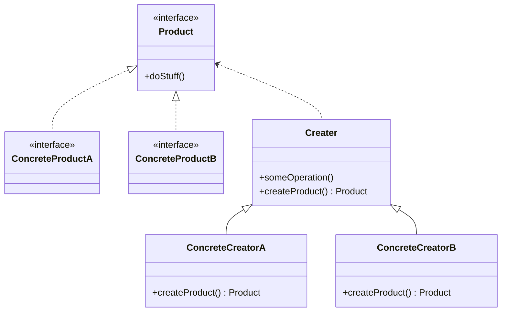

Type: **Creational Pattern**

Factory Method is a creational design pattern that provides an interface for creating objects in a superclass, but allows subclasses to alter the type of objects that will be created.

Class Diagram Example:

## Code Example:

        // Product
        interface ITransportation {
            numberOfWheels: number;
        };

        // ConcreteProduct
        interface Bicycle extends ITransportation {
            hasBicycleRearSaddle: boolean;
        };

        interface Car extends ITransportation {
            isRoadster: boolean;
        };

        // Creator
        abstract class Transportation implements ITransportation {
            public abstract createTransportation(numberOfWheels: number, ...arg: any[]): ITransportation;

            public logInfo(transportation: ITransportation): void {
                console.log(`Number of wheels: ${transportation.numberOfWheels}`);
            };
        };

        // ConcreteCreator
        class BicycleCreator extends Transportation {
            public createTransportation(numberOfWheels: number, hasBicycleRearSaddle: boolean): Bicycle {
                return {
                    numberOfWheels,
                    hasBicycleRearSaddle,
                };
            };
        };

        class CarCreator {
            public createTransportation(numberOfWheels: number, isRoadster: boolean): Car {
                return {
                    numberOfWheels,
                    isRoadster,
                };
            };
        };

        // Usage
        const bicycle = new BicycleCreator();
        bicycle.createTransportation(2, true);
        bicycle.logInfo();

        const car = new CarCreator();
        car.createTransportation(4, true);
        car.logInfo();

Source:
- https://refactoring.guru/design-patterns/factory-method
- https://www.youtube.com/watch?v=54-rJHUM2L8&list=PLw0w5s5b9NK7TSuHpxOMvVtRuaEgHQczQ&index=12
- https://dev.to/jmalvarez/factory-method-pattern-in-typescript-2a1n
