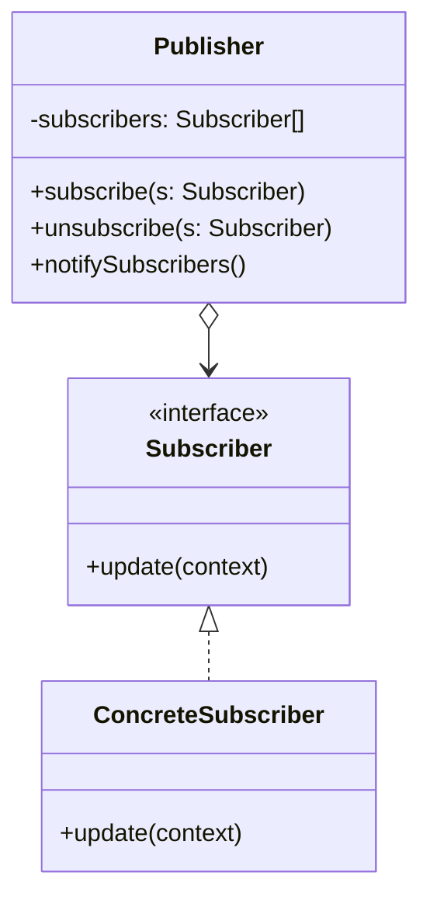

Type: **Behavioral Pattern**

Observer is a behavioral design pattern that lets you define a subscription mechanism to notify multiple objects about any events that happen to the object they’re observing.

This mechanism consists of:
1. An array field for storing a list of references to subscriber objects.
2. Several public methods which allow adding subscribers to and removing them from that list.

Cons
- Subscribers are notified in random order.

Class Diagram Example:

## Code Example:

        class Publisher {
            private subscribers: Subscriber[];

            public subscribe(subscriber: Subscriber) {
                subscribers.push(subscriber);
            };

            public unsubscribe(subscriber: Subscriber) {
                const removeIndex = subscribers.findIndex((subscriberMember) => subscriberMember === subscriber);
                subscribers.splice(removeIndex, 1);
            };

            public notify(data) {
                subscribers.forEach((subscriberMember) => subscriberMember.update(data));
            };
        };

        class AppLogSubscriber {
            public update(data) {
                console.log('Log data in app: ', data);
            }
        }

        // Usage
        const publisher = new Publisher();
        const appLogger = new AppLogSubscriber();

        publisher.subscribe(appLogger);
        publisher.notify('Send data');

Source: https://refactoring.guru/design-patterns/observer
