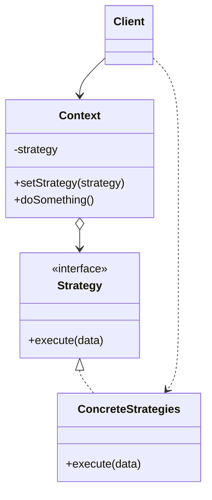
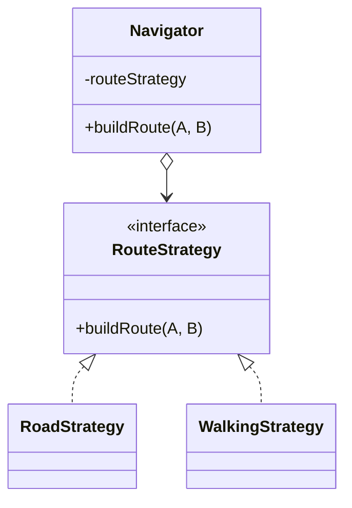

Type: **Behavioral Pattern**

Strategy is a behavioral design pattern that lets you define a family of algorithms, put each of them into a separate class, and make their objects interchangeable.

Class Diagram Example:

## Code Example:
- Class Diagram

- Code

        class WalkingStrategy {
            public buildRoute(A, B) {};
        };

        class RoadStrategy {
            public buildRoute(A, B) {};
        };

        class Navigator {
            private routeStrategy;
            public setStrategy(_routeStrategy) {
                this.routeStrategy = _routeStrategy;
            };
            public buildRoute(A, B) {
                this.routeStrategy.buildRoute(A, B);
            };
        };

        // Usage
        const navigator = new Navigator();
        if (selectedStrategy ==== 'road') {
            navigator.setStrategy(new RoadStrategy());
        }
        if (selectedStrategy ==== 'walking') {
            navigator.setStrategy(new WalkingStrategy());
        }
        navigator.buildRoute(A, B);

Source: https://refactoring.guru/design-patterns/strategy
